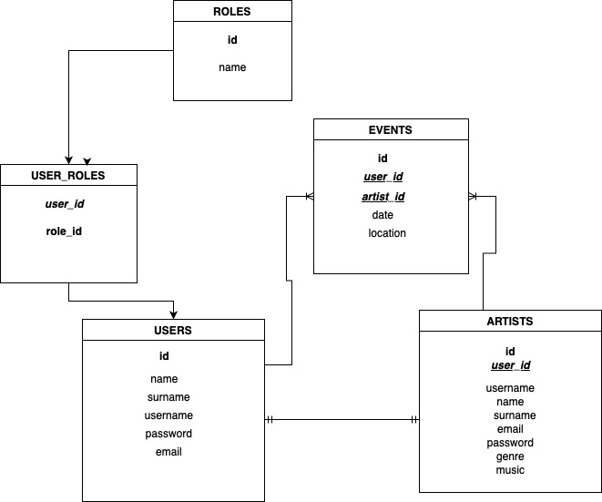

# Welcome to my second Backend App!

<details>
  <summary>MUSIC LOCAL TALENT 📝</summary>
  <ol>
    <li><a href="#objetivo">Objetivo</a></li>
    <li><a href="#sobre-el-proyecto">Sobre el proyecto</a></li>
    <li><a href="#stack">Stack</a></li>
    <li><a href="#diagrama-bd">Diagrama</a></li>
    <li><a href="#instalación-en-local">Instalación</a></li>
    <li><a href="#endpoints">Endpoints</a></li>
    <li><a href="#contribuciones">Contribuciones</a></li>
    <li><a href="#desarrollo">Desarrollo</a></li>
    <li><a href="#agradecimientos">Agradecimientos</a></li>
    <li><a href="#contacto">Contacto</a></li>
  </ol>
</details>

## Objetivo

Este proyecto requería una API funcional conectada a una base de datos de una app de músicos y usuarios apasionados de la música, de una misma ciudad. 

## Sobre el proyecto

He decidido crear una API funcional para apoyar el talento local, ayudar a los artistas y apasionados de la música de la ciudad a disfrutar y a tener acceso directo  a todos los eventos que sucedan.
 Les permitiría descubrir nueva música, realizar un seguimiento de los conciertos próximos de la ciudad y conectar con los artistas, confirmando la asistencia a sus favoritos.

## Stack

Tecnologías utilizadas:

<div align = "center">

<a href="https://www.expressjs.com/">
    
</a>
<a href="https://nodejs.org/es/">
    
</a>
<a href="https://developer.mozilla.org/es/docs/Web/JavaScript">
    
</a>

<a href= "https://www.postman.com">

 </div>

## Diagrama BD



## Instalación en local

1. Clonar el repositorio
2. `$ npm install`
3. Conectamos nuestro repositorio con la base de datos
4. `$ Ejecutamos las migraciones`
5. `$ Ejecutamos los seeders`
6. `$ npm run dev`
7. ...

## Endpoints

<details>
<summary>Endpoints</summary>
Dependiendo de si eres admin o no puedes acceder a según qué endpoint.

- AUTH

  - REGISTER

          POST http://localhost:3000/api/register

    body:

    ```js
        {
        "username": "Marialv",
        "name": "Maria",
        "surname": "Lázaro",
        "email": "marialv@example.com",
        "phone": "6884040",
        "password": "12345678"
        }
    ```

  - LOGIN

          POST http://localhost:3000/api/login

    body:

    ```js
        {
            "email": "marialv@example.com",
            "password": "12345678"
        }
    ```

- USUARIOS

   -  VER TODOS LOS USUARIOS 
        
        
            GET http://localhost:3000/api/users/getAllPaginated

    - PERFIL DE USUARIO
             
             GET http://localhost:3000/api/users/:id
   
    - MODIFICACION DE DATOS DEL PERFIL
             
             PATCH http://localhost:3000/api/users/:id
            
- ARTISTAS
     -  VER TODOS LOS ARTISTAS
        
        
            GET http://localhost:3000/api/artist
    
- EVENTOS

  - MIS EVENTOS
       
       
            POST http://localhost:3000/api/events/miseventos/:id
   
    - CREACIÓN DE EVENTOS
       
       
            POST http://localhost:3000/api/events


    body:

    ```js
        {
            "user_id": 3,
            "arist_id": 5,
            "datee": "16/03/2024",
            "location": "Sala REM",
        }
    ```


 
   -TODOS LOS EVENTOS
        
            GET http://localhost:3000/api/events
     

  </details>

## Contribuciones

Las sugerencias y aportaciones son siempre bienvenidas.

Puedes hacerlo de dos maneras:

1. Abriendo una issue
2. Crea un fork del repositorio
   - Crea una nueva rama
     ```
     $ git checkout -b feature/nombreUsuario-mejora
     ```
   - Haz un commit con tus cambios
     ```
     $ git commit -m 'feat: mejora X cosa'
     ```
   - Haz push a la rama
     ```
     $ git push origin feature/nombreUsuario-mejora
     ```
   - Abre una solicitud de Pull Request


## Desarrollo:

```js
const developer = "María Lázaro";

console.log("Desarrollado por: " + developer);
```


## Contacto

<a href = "mailto:holamarialazaro@gmail.com"></a>
<a href="https://www.linkedin.com/in/linkedinUser/" target="_blank"></a>

</p>